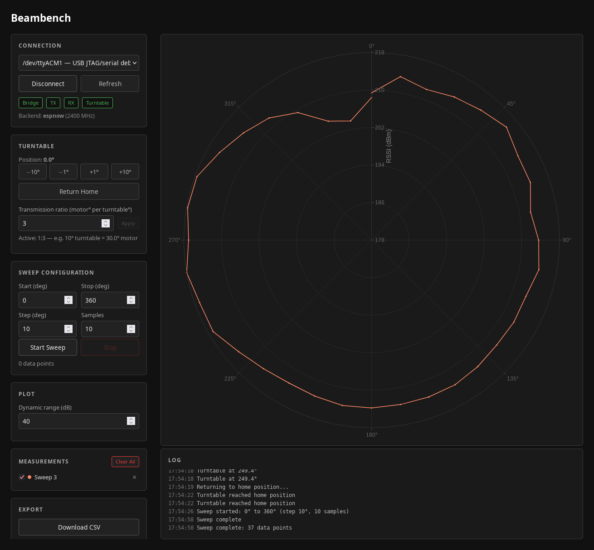

# Beambench — Open-Source Antenna Pattern Measurement

Build a desktop antenna-measurement rig out of four ESP32-C3 boards and a motorised turntable. Beambench rotates the antenna under test, measures how strongly a radio signal arrives at each angle, and plots the result live in your browser as a **polar diagram** — so you can actually *see* in which directions an antenna sends or receives best.

Hardware, firmware, and the PC app are all open source.

> ⚠️ **Disclaimer — proof of concept**
>
> This entire project was written with [Claude Code](https://claude.com/claude-code) and has **not yet undergone any proper code review**. It exists purely as a proof of concept for demo purposes. Do not rely on it for anything that matters — expect rough edges, missing validation, and untested corners.

## Screenshot



## How it works

The antenna under test sits on a motorised turntable. A **TX** board sends short radio packets; an **RX** board measures the signal strength of those packets. A **Turntable** board rotates the motor through 360° in small steps, and a **Bridge** board hooks the whole thing up to the PC over USB. The browser UI plots the result as it comes in — angle = direction, distance from the centre = signal strength.

```
                       ┌──────────────────────────┐
                       │     PC — Browser UI      │
                       └─────────────┬────────────┘
                                     │ USB-serial
                       ┌─────────────┴────────────┐
                       │   ESP32-C3 — Bridge      │
                       └─────────────┬────────────┘
                                     │
                                     │  ESP-NOW (2.4 GHz)
                                     │
            ┌────────────────────────┼────────────────────────┐
            │                        │                        │
   ┌────────┴─────────┐    ┌─────────┴────────┐    ┌──────────┴────────┐
   │  ESP32-C3 — TX   │    │  ESP32-C3 — RX   │    │   ESP32-C3 —      │
   │  on turntable,   │    │  fixed position, │    │   Turntable —     │
   │  antenna under   │    │  reference ant., │    │   drives the      │
   │  test, battery   │    │  measures signal │    │   stepper motor   │
   └──────────────────┘    └──────────────────┘    └───────────────────┘
            │                        ▲
            │   radio signal under   │
            └────── measurement ─────┘
```

## Repository layout

```
software/
├── protocol/   Shared no_std message types (postcard + serde)
├── firmware/   Unified ESP32-C3 firmware; role chosen via Cargo feature
└── pc/         PC app — Axum backend + Svelte frontend with Plotly polar plot
```

The firmware is **one crate with feature flags** (`role-bridge`, `role-tx`, `role-rx`, `role-turntable`). Every board flashes the same code; only the feature changes.

### Protocol layers

- **PC ↔ Bridge:** COBS-framed [postcard](https://docs.rs/postcard) over USB-serial (or TCP for the simulator)
- **Bridge ↔ TX/RX/Turntable:** postcard-serialised messages over ESP-NOW

## Quick start

Requires Rust nightly and [probe-rs](https://probe.rs/) for flashing.

```sh
# Try it with no hardware: bridge simulator + dev server
just sim                       # in one shell
cd software/pc && just dev     # in another → http://localhost:5173
```

For real hardware, flash one role per board:

```sh
cd software/firmware
cargo run --release --no-default-features --features role-bridge
cargo run --release --no-default-features --features role-tx
cargo run --release --no-default-features --features role-rx
cargo run --release --no-default-features --features role-turntable
```

Once the boards are paired, follow-up firmware updates can be pushed wirelessly with `just ota-<role>`.

## Hardware

Four **ESP32-C3-DevKit-RUST-1** boards plus a stepper-motor driver. Default driver is the **MKS SERVO42D** (step/dir); a UART variant (SERVO42C) is also supported.

**Step/Dir wiring (default):**

| ESP32-C3 | SERVO42D | Function |
|----------|----------|----------|
| 3.3 V    | COM      | Common anode |
| GPIO4    | STP      | Step pulse |
| GPIO5    | DIR      | Direction |
| GPIO6    | EN       | Enable (active low) |
| GND      | GND      | Ground |
| —        | V+       | 12–24 V supply |

Motor: 200 full steps × 16 microsteps = 3200 steps/revolution (≈ 0.1125°/step). The motor-to-turntable gear ratio is configurable in the UI (default 1:3).

## Testing

```sh
just test                                      # all host-side tests
cd software/pc && cargo test --features sim    # PC unit + integration suite
```

The integration suite spins up an in-process **bridge simulator** that generates synthetic cardioid RSSI data — useful for testing the whole pipeline without flashing anything.

## License

Released under the [MIT License](LICENSE). © 2026 Systemscape GmbH.
